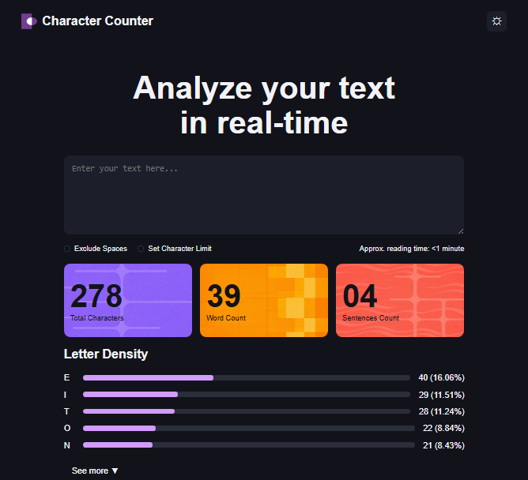
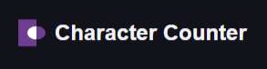
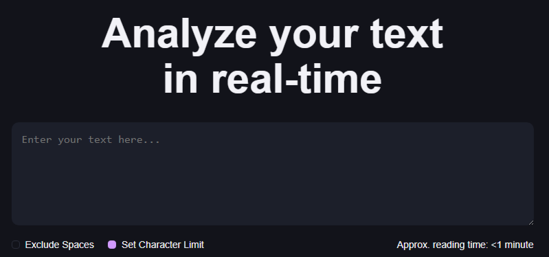
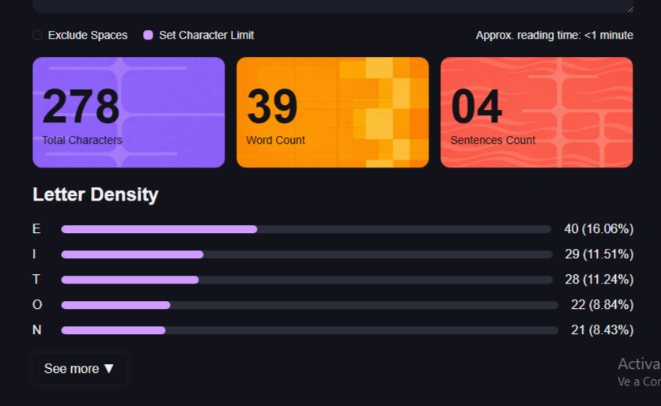

# Proyecto: Character Counter
Este proyecto consiste en realizar el maquetado y estilizacion de un contador de caracteres en tiempo real. 

## Objetivos del proyecto
El objetivo principal del proyecto fue construir la maquetación semántica y estructura visual usando HTML y CSS, para luego continuar el proyecto con JavaScript.

## Tecnologias Utilizadas
* **HTML5:** Para armar la estructura y las secciones de la pagina de manera ordenada y organizada.
* **CSS3:** Se utilizó para estilizar el proyecto aportando fuentes, colores, orden visual. 
* **Flexbox:** Se uso para alinear de manera flexible, tanto vertical como horizontalmente, el header, los checboxes y las barras de las letras. 
* **Grid:** Fue elegido para acomodar las 3 "cards" facilmente.
* **Google Fonts:** Se utilizó para incluir la tipografia del proyecto. 

## Como se Organizó el HTML
Se estructuró el HTML utilizando etiquetas semanticas para que quede prolijo y ordenado:
* "<header>": Dentro de "header" se colocó el logo y nombre de la pagina, y un botón para cambiar el tema de claro a oscuro. 
* "<main>": Esta etiqueta se usó para  marcar el contenido principal y centrarlo en la pantalla. 
* "<section>": Fue utilizada para separar por secciones el contenido de la pagina. Cada una con su respectiva clase:
  * <section class="hero">: Contiene un "<h2>" y el "<textarea>" donde el usuario escribe su texto.
  * "<section class="checkboxes">": Agrupa los "checkboxes" de configuracion dentro de la etiqueta "<label>" para que sea mas accesible. Tambien cuenta con una etiqueta de "
" del tiempo estimado de lectura.
  * "<section class="results">": Contiene las tres tarjetas (".card-purple", ".card-orange", ".card-coral").
  * "<section class="letter-density">": En esta ultima seccion se encuentran las filas de las letras ordenadas en forma de lista usando la etiqueta "<meter>" para las barras, junto al "<button>"para ver mas.

## CSS
Para el diseño del proyecto en CSS se utilizó:
* **Variables (":root"):** Donde se guardo la paleta de colores utilizada a lo largo del trabajo. Se crearon las variables para ahorrar tiempo escribiendo codigo y para facilitar si en un futuro se quiere modificar un color especifico de la pagina.
* **Reseteo (*):** Al inicio se agrego  "margin: 0", "padding: 0" y "box-sizing: border-box". Esto sirve para limpiar los márgenes que los navegadores traen por defecto y que te desacomodan todo. El "box-sizing: border-box" es clave porque hace que si le ponemos paddings o bordes a cualquier elemento, se sumen hacia adentro y no alteren el tamaño real de la caja, evitando que se rompa la estructura.
* **Estructura del contenedor principal (main):** Se configuro un "max-width: 800px" junto con "margin: 40px auto". Esto se hizo para que en pantallas muy grandes el diseño no se estire de forma infinita hacia los lados, sino que se mantenga centrado y cómodo para leer. Para ordenar las secciones una debajo de la otra se utilizó Flexbox en modo columna ("flex-direction: column") con un "gap: 20px" para tener una separación prolija.
* **Cabecera alineada (header):** Se utilizó Flexbox para ordenar los elementos del header en horizontal.Se aplicó "justify-content: space-between" para empujar el logo con el título hacia la izquierda y el botón de configuración a la derecha. Al botón se le agrego una transición ("transition: box-shadow 0.1s ease") y (":hover") para que cuando el usuario pase el cursor, tire una sombra iluminada muy sutil.
* **Bloque de texto principal (hero):** El título "h2" cuenta con un tamaño grande de "60px" y un "line-height: 1.1" para que las letras queden bien juntas y compactas. Al "textarea" se e dio un ancho del "100%" para que ocupe todo el espacio disponible y se agrego el color de fondo gris oscuro ("--card-background").
* **Controles y personalización de Checkboxes:** Los navegadores te ponen por defecto un checkbox que no se puede diseñar de forma directa. Para cambiar esto, usamos "appearance: none" con sus prefijos "-webkit-" y "-moz-" para apagar el diseño del sistema operativo. Así se pudo darles una medida de "12px", bordes redondeados con "border-radius: 4px" y se agrego el estado ":checked" para que cuando se seleccionen, cambien al color rosa ("--progress-bar") con una transición suave.
* **Utilizacion de CSS Gridd:** Se decidio usar CSS Grid con "grid-template-columns: repeat(3, 1fr)" ya que es la mejor herramienta para armar layouts en columnas.
* **Diseño interno y fondos de las "cards":** Adentro de las tarjetas (".card-purple", ".card-orange", ".card-coral") se uso Flexbox en forma de columna("flex-direction: column") para que el número gigante quede arriba y la etiqueta de texto quede abajo. Luego se uso "align-items: flex-start" para que todo el contenido se alinee bien contra el margen izquierdo. Los patrones de fondo se fijaron a la derecha ("background-position: right center") y le dio tamaños exactos de "300px" y "250px" con "background-repeat: no-repeat" para que no se dupliquen ni tapen los textos.
* **Barras de las letras:** En la sección de "Letter Density", cada fila es un contenedor horizontal con Flexbox. Lo principal fue agregar "flex-grow: 1" lo que hace que la barra sea elástica y se estire dinámicamente ocupando todo el espacio libre que queda en el centro, empujando el porcentaje hacia la derecha de forma perfecta.

# Dificultades
* **Modificar el "<meter>":** Al principio hubo complicaciones para cambiarle el estilo orginal (color verde) que por defecto traen las barras de progreso. Se pudo modificar investigando, y utilizando "::-webkit-meter-bar" y "::-webkit-meter-optimum-value" para modificar el borde y agregar el color rosa. 

# Capturas del Resultado Final

